# FastAPI and MongoDB template

## Basic architecture

```mermaid
graph TB
  
    USER(👤User)
    DTO[📄DTO]
    ROUTES[🚦Routes]
    CORE[⚙️Core]
    MODELS[🗃️Models]

    %% User interacting with the DTO layer
    USER -- "HTTP request" --> DTO
    DTO -- "HTTP response" --> USER

    %% DTO and Routes exchange
    DTO -- "Transform request" --> ROUTES
    ROUTES -- "Transform response" --> DTO

    %% Routes and Core interaction
    ROUTES <-- "Business logic" --> CORE

    %% Routes and Models interaction
    CORE <-- "Query data" --> MODELS
```


## Env
```bash
# prod, dev, test
ENV=

# optional, otherwise state each value
MONGO_URI=

MONGO_USER=
MONGO_PASSWORD=
MONGO_HOST=
MONGO_PORT=

DATABASE_NAME=
DATABASE_NAME_DEV=
DATABASE_NAME_TEST=

# default: '?authSource=admin'
# can be replaced by an empty string (e.g "")
DATABASE_ARGS=

# obtain gateway refresh token
BITA_SDK_INITAL_REFRESH_TOKEN=
BITA_GATEWAY_HOST=

SECRET_KEY_JWT=
```

## Run
```bash
uvicorn app.main:app
```

To get options:
```bash
univcorn --help
```


## Tests
Testing is implemented using the PyTest framework:
```bash
pytest tests
```
